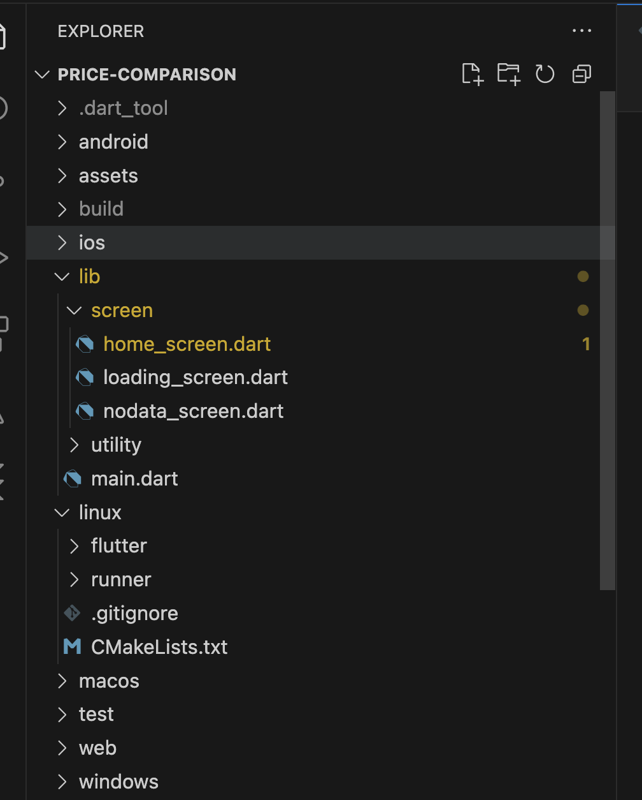
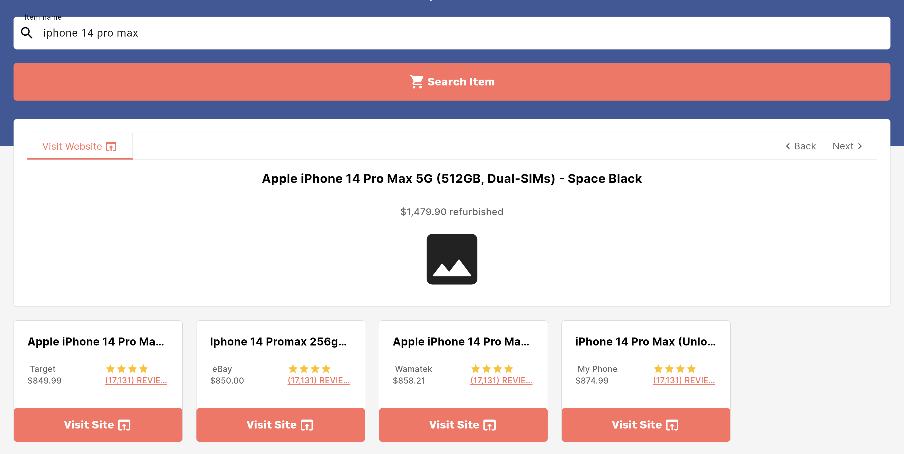
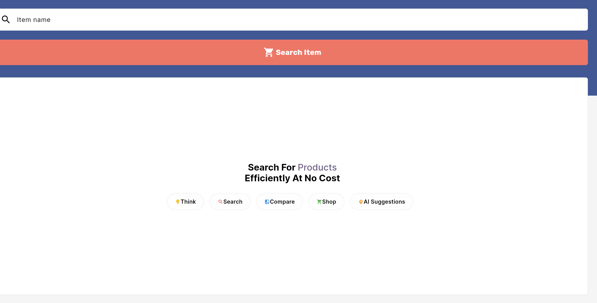
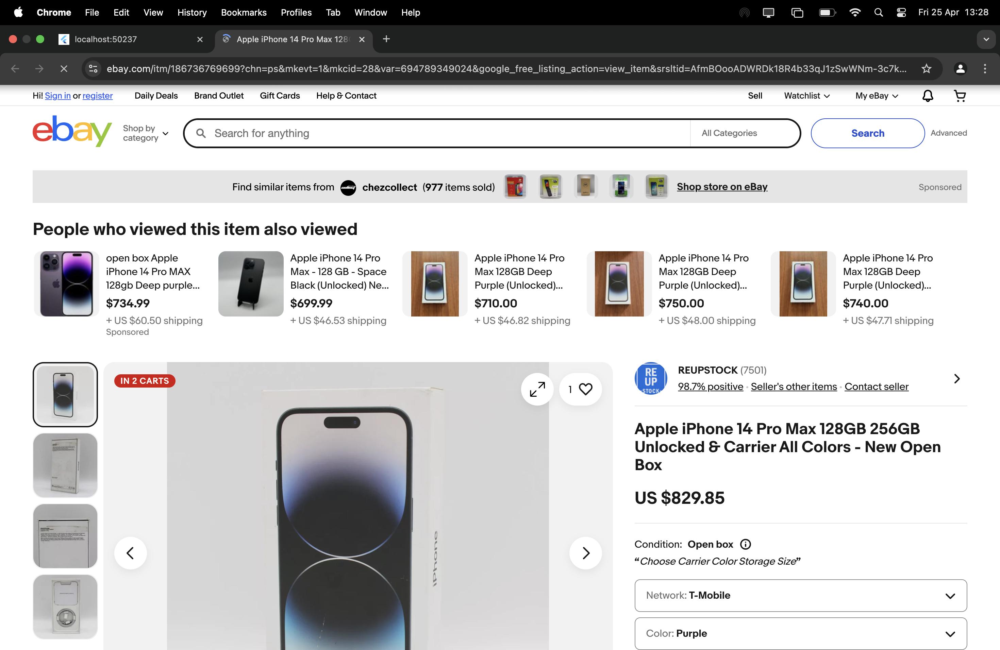

# 🛍️ Price Comparison App


**A modern Flutter-based application that allows users to compare product prices across multiple platforms using RapidAPI.**  
Built with a beautiful UI and powerful real-time functionality, this app ensures smart and informed shopping decisions.

The app supports Android, iOS, Web, and Desktop, making it a cross-platform solution for everyone.

---

## 🚀 Overview

This app fetches product price data from various e-commerce platforms using APIs available on [RapidAPI](https://rapidapi.com/).  
It allows users to:

- Search for any product
- View prices from different online stores (like Amazon, eBay, Walmart, etc.)
- See side-by-side comparisons
- Set alerts for price drops
- Access detailed product information

---

## 📂 Repository Structure

<kbd>
  
</kbd>


---

## 🔑 Using RapidAPI

This app uses RapidAPI to retrieve price and product data. To set it up:

1. Create an account at [RapidAPI](https://rapidapi.com/).
2. Subscribe to APIs like:
   - Amazon Price API
   - Walmart Products API
   - eBay API
   - Any other product-related APIs
3. Get your **X-RapidAPI-Key**.
4. Add the key to your `.env` file or API config in the app.

> **Note:** API limits and pricing depend on your RapidAPI plan.

---

## ✨ Features

- 🔍 Product search with keyword input
- 📈 Real-time price comparison from multiple platforms
- 📉 Price drop alerts
- 💬 Product details and reviews
- 📲 Mobile & desktop support
- 🌐 Cross-platform (Flutter Web, Android, iOS, Desktop)

---

## 📸 Screenshots

<kbd>
  
  
  
</kbd>

---

## 🌐 Platform Support

- ✅ Android
- ✅ iOS
- ✅ Web (Flutter Web)
- ✅ macOS, Windows, Linux (Flutter Desktop)

---

## 🧠 Gemini AI Integration (Optional)

To enable **AI-based product recommendations and insights**:

1. Visit [Google AI Studio](https://aistudio.google.com/app/apikey).
2. Generate your API key.
3. Add it to your app config for Gemini integration.

---

## 🔧 Getting Started

```bash
# Clone the repository
git clone https://github.com/your-username/price-comparison-app.git

# Install dependencies
flutter pub get

# Run the app
flutter run


